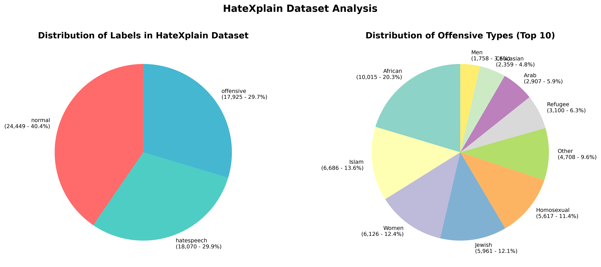

# Enhancing Reasoning in LLM-based Hate Speech Detection via Reinforcement Learning


## Dataset

[HateXplain](https://github.com/hate-alert/HateXplain) - Mathew et al., AAAI 2021

### Dataset Distribution



## Environment Setup

### Using pip
```bash
pip install -r requirements.txt
```

### Using conda
```bash
conda env create -f environment.yml
conda activate hate_speech_detection
```

### Requirements
- Python 3.11+
- matplotlib >= 3.10.0
- numpy >= 1.26.0
- pandas >= 2.0.0
- scikit-learn >= 1.3.0

## Model

Reinforcement Learning